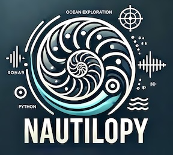

# Nautilopy: 3D Underwater Cave Mapping with Sonar Technology
Thomas Guilment, Gabriele Morra, Orhun Aydin, Stefany Carty

<!-- WARNING: THIS FILE WAS AUTOGENERATED! DO NOT EDIT! -->



## Project Overview

Nautilopy is a Python module for 3D underwater cave mapping using sonar
technology. This library provides tools and algorithms to process sonar
data, generate 3D models of underwater cave systems, and visualize
complex submerged environments.

### Dataset Description

The dataset, provided by Angelos Maillos et *al.* 2017, includes sensor
data collected during an AUV mission in July 2013. A diver guided the
AUV due to the spatial complexity of the caves.

### Sensor Suite

- Two mechanically scanned imaging sonars (MSIS)
- Doppler velocity log (DVL)
- Two inertial measurement units (IMUs)
- Depth sensor
- Vertically mounted camera (for ground truth validation)

### Available Data Topics from CSV files

1.  `/depth_sensor`: DS2806 HPS-A pressure sensor data
2.  `/dvl_linkquest`: LinkQuest NavQuest 600 sensor data
3.  `/imu_adis`: Analog Devices ADIS16480 sensor data
4.  `/imu_adis_ros`: ADIS16480 orientation in standard ROS format
5.  `/imu_xsens_mti`: Xsens MTi sensor data
    <!-- REMOVED (FILE TOO LARGE) 6. `/imu_xsens_mti_ros`: Xsens MTi orientation in standard ROS format -->
6.  `/odometry`: Robot pose estimation
7.  `/sonar_micron`: Tritech Micron DST sensor beam data
8.  `/sonar_micron_ros`: Micron data in standard ROS Laserscan format
9.  `/sonar_seaking`: Tritech Super SeaKing DFP profiler sensor beam
    data
    <!-- REMOVED (FILE TOO LARGE) 11. `/sonar_seaking_ros`: Profiler data in standard ROS Laserscan format -->
10. `/tf`: Sensor offset transformations

## Sonar Specifications

| Specification | Imaging sonar - Tritech Micron DST | Profiling sonar - Tritech Super SeaKing DFP |
|----|----|----|
| Frequency | Chirped 650 to 750 kHz | 0.6 MHz \| 1.1 MHz |
| Max range | 75 m (20 m used) | 80 m \| 40 m (10 m used) |
| Horizontal beamwidth | 3° | 2° \| 1° |
| Vertical beamwidth | 35° | 2° \| 1° |
| Scan rate (360° sector) | 5 − 20 sec | 4 − 25 sec |

## Available Data in Python

A pre-processing is done on the CSV sensors data to create a Pickle
folder containing the following interpolated variables.

### 1. Horizontal Micron Sonar Data

- `v_timestamp_sonar_micron_final`: Timestamps
- `m_sonarReceivedIntensity_micron_final`: (397x45587) Received energy
  per range and time
- `m_interp_micron_YPR`: (45587x3) Yaw, Pitch, Roll over time
- `m_interp_pos_micron_final`: (45587x3) 3D Cartesian position over time
- `v_angles_rad_micron_final`: (45587x1) Scanning angle over time
  (radians)
- `v_range_micron`: (397x1) Range values (0 to 20 meters)
- `v_offset_ypr_micron`: (3x1) Offset position from AUV reference

### 2. Vertical Seaking Sonar Data

- `v_timestamp_sonar_seaking_final`: Timestamps
- `m_sonarReceivedIntensity_seaking_final`: (50x97477) Received energy
  per range and time
- `m_interp_micron_YPR`: (97477x3) Yaw, Pitch, Roll over time
- `m_interp_pos_micron_final`: (97477x3) 3D Cartesian position over time
- `v_angles_rad_micron_final`: (97477x1) Scanning angle over time
  (radians)
- `v_range_micron`: (50x1) Range values (0 to 20 meters)
- `v_offset_ypr_seaking`: (3x1) Offset position from AUV reference

## Current/Future work

1.  **Walls segmentation**  
    How to automatically extract the cave walls from sonar and sensor
    data? One idea is to annotate what we think is wall data and then
    apply AI/ML algorithms.

2.  **3D confidence map**  
    From the wall segmentation, we should be able to get a first 3D map
    with a confidence level assigned for each point according to the
    “wall segmentation” confidence algorithm.

3.  **3D confidence map extension by interpolation/extrapolation**  
    The final map could be interpolated to understand the entire cave.
    This interpolation could also have a confidence level depending on
    how far it is from the base 3D map.

4.  **Photogrammetry**  
    We have the video that should help add an extra data source. We
    could use the video combined with the altitude estimation to use the
    3D photogrammetry and correlate the detected point of interest with
    the 3D map made from the sonar

5.  **SLAM**  
    Compared to the work from Maillos *et al.*, 2015), the authors used
    simultaneous localization and mapping (SLAM) methods that I didn’t
    use. This is supposed to improve the 3D position of the AUV
    (Autonomous Underwater Vehicle) and improve the 3D map quality.

6.  **Real-time and Optimization**  
    When we have a SLAM method that we trust and everything is working.
    Then, we can think of real-time mapping and confidence map creation.

## Project Folder architecture Template

    project_root/
    ├── nbs/                 # Jupyter notebooks
    │   ├── 00_core.ipynb
    │   ├── 01_Preprocessing.ipynb
    │   ├── 02_Presentation.ipynb
    │   └── ...
    ├── nautilopy/           # Auto-generated Python modules
    ├── docs/                # Auto-generated documentation
    ├── tests/               # Additional tests (if needed)
    ├── data/                # Data files (consider .gitignore for large files)
    ├── models/              # Saved model files
    ├── settings.ini         # nbdev configuration
    ├── README.md
    └── LICENSE

## Setting up nautilopy for development

This guide will walk you through setting up nautilopy on your local
machine.

### Prerequisites

- Git

- Conda or Mamba package manager

- Recommendation: If you are new to using `nbdev`, this [nbdev
  walkthrouhg](https://nbdev.fast.ai/tutorials/tutorial.html) has some
  useful pointers to get you started:

### Step 1: Create a Virtual Environment

Choose either conda or mamba to create your virtual environment:

#### Using Conda

``` bash
conda create --name nautilopy_env
conda activate nautilopy_env
```

#### Or using Mamba

``` bash
mamba create --name nautilopy_env
mamba activate nautilopy_env
```

### Step 2: Clone the Repository

Clone the nautilopy repository from GitHub:

``` bash
git clone https://github.com/20KUTS/nautilopy.git
cd nautilopy
```

``` sh
# make sure nautilopy package is installed in development mode
$ pip install -e .
```

### Step 3: Install Requirements

Use the provided `s_install_requirements.py` script to install the
necessary packages:

#### Using Conda (default)

``` bash
python s_install_requirements.py ./requirements.txt
```

#### Using Mamba

``` bash
python s_install_requirements.py ./requirements.txt --manager mamba
```

This script will automatically install all required packages listed in
the `requirements.txt` file.

### Step 4: Verify Installation

After the installation is complete, you can verify that nautilopy is
correctly set up by importing it in a Python session:

``` python
import nautilopy
```

If no errors occur, the installation is successful.

### Step 5: Development with nbdev from FastAI

Then you can start developing followng the [nbdev
walkthrouhg](https://nbdev.fast.ai/tutorials/tutorial.html)

    # make changes under nbs/ directory
    # ...

    # compile to have changes apply to nautilopy
    $ nbdev_prepare

### Troubleshooting

If you encounter any issues during the setup process, please check the
following:

1.  Ensure your virtual environment is activated.
2.  Verify that you have the latest version of conda or mamba.
3.  Check your internet connection, as package downloads require
    internet access.
4.  If a specific package fails to install, try installing it manually
    using `pip install <package_name>` or
    `conda install <package_name>`.

If you need more help, please refer to the project’s GitHub issues page
or contact the maintainers.

### Documentation

Documentation can be found hosted on this GitHub
[repository](https://github.com/20KUTS/nautilopy)’s
[pages](https://20KUTS.github.io/nautilopy/). Additionally, you can find
package manager-specific guidelines on
[conda](https://anaconda.org/20KUTS/nautilopy) and
[pypi](https://pypi.org/project/nautilopy/) respectively.

## How to use

TO DO (redirect to notebooks later)

``` python
1+1
```

    2
